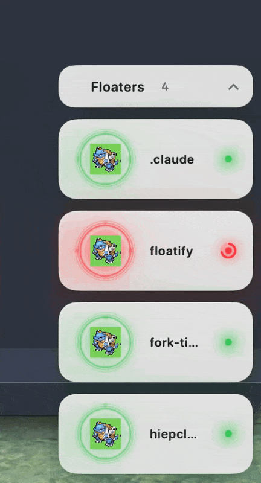

## Floatify

Website: https://floatify-app.vercel.app



Floatify is a macOS menu bar app with two overlay types:

- Temporary notifications sent by the `floatify` CLI
- Persistent session floaters for Claude Code and Codex

## What Ships Today

- One persistent floater per live Claude Code or Codex session
- Project label, color status, sprite avatar, git modified file count, and last activity time
- Theme, display style, and idle timeout in the Settings window
- Drag to move floaters, close one floater, or restack them with Arrange
- Click a floater to open the project in VS Code when the path is known
- Temporary notifications still support `bottomLeft`, `bottomRight`, `topLeft`, `topRight`, `center`, `menubar`, `horizontal`, and `cursorFollow`
- FIFO pipe IPC at `/var/tmp/floatify.pipe`
- Non-activating `NSPanel` windows that stay visible without stealing focus

## Current Gaps

- Codex can infer task state from session logs.
- Claude session discovery is automatic, but accurate running and complete state still depends on hooks.
- `~/.floatify/positions.json` only affects temporary notifications. It does not style persistent session floaters.
- Persistent floater placement is drag-and-arrange today. There is no full layout editor yet.

## Install

Prerequisites:

- macOS 11 or later
- XcodeGen installed with `brew install xcodegen`

Recommended install:

```bash
git clone https://github.com/HiepPP/floatify.git
cd floatify
./build.sh
```

`./build.sh` generates the Xcode project when needed, builds the app and CLI, installs `Floatify.app` to `/Applications`, updates `/usr/local/bin/floatify`, and relaunches the app.

Compile-only commands:

```bash
cd Floatify
xcodegen generate
xcodebuild -project Floatify.xcodeproj -scheme Floatify -configuration Debug build CODE_SIGN_IDENTITY="-" CODE_SIGNING_REQUIRED=NO
xcodebuild -project Floatify.xcodeproj -scheme floatify -configuration Debug build CODE_SIGN_IDENTITY="-" CODE_SIGNING_REQUIRED=NO
```

## Quick Start

Temporary notification:

```bash
floatify --message "Deploy done!" --position bottomRight --duration 6
```

Status updates:

```bash
floatify --status running
floatify --status complete
```

More examples:

```bash
floatify --message "Watch this" --position cursorFollow --duration 8
floatify --message "Menu bar alert" --position menubar --duration 5
floatify --message "Horizontal alert" --position horizontal --duration 5
```

## CLI Reference

```bash
floatify [options]
```

| Flag | Meaning | Default |
| --- | --- | --- |
| `--message` | Temporary notification text | `Task complete!` |
| `--position` or `--corner` | Notification position | `bottomRight` |
| `--duration` | Auto-dismiss seconds for notifications | `6` |
| `--project` | Project label in payload | Current folder name |
| `--effect` | Notification entry effect override | Position default |
| `--status` | Session status update | Not set |

Status values:

- `running`
- `idle`
- `complete`
- `done`

Current status behavior:

- `running` shows the red running state.
- `idle` shows the yellow idle state.
- `complete` and `done` enter idle first, then auto-transition to green after the idle timeout. The default timeout is 15 seconds.

## Settings And Overrides

Settings window controls persistent floaters:

- Theme: dark or light
- Display style: compact, regular, or large
- Idle timeout: seconds before idle turns into complete

Optional JSON override for temporary notifications only:

```json
{
  "bottomRight": {
    "margin": 20,
    "width": 320,
    "height": 80,
    "stackOffset": 6
  }
}
```

Save that file to `~/.floatify/positions.json`.

## Hook Setup

Floatify discovers live Claude Code and Codex sessions automatically. Hooks improve status accuracy.

Claude Code example:

```json
{
  "hooks": {
    "Stop": [
      {
        "hooks": [
          {
            "type": "command",
            "command": "sh -c '/usr/local/bin/floatify --status complete >/dev/null 2>&1'"
          }
        ]
      }
    ],
    "SessionEnd": [
      {
        "hooks": [
          {
            "type": "command",
            "command": "sh -c '/usr/local/bin/floatify --status complete >/dev/null 2>&1'"
          }
        ]
      }
    ]
  }
}
```

Current Claude gap:

- The app does not infer Claude running state on its own.
- This repo does not recommend `UserPromptSubmit` for Claude because it can interfere with prompt flow.

Codex example:

```json
{
  "hooks": {
    "UserPromptSubmit": [
      {
        "hooks": [
          {
            "type": "command",
            "command": "sh -c '/usr/local/bin/floatify --status running >/dev/null 2>&1'"
          }
        ]
      }
    ],
    "Stop": [
      {
        "hooks": [
          {
            "type": "command",
            "command": "sh -c '/usr/local/bin/floatify --status complete >/dev/null 2>&1'"
          }
        ]
      }
    ]
  }
}
```

The repo examples use `~/.claude/settings.json` for Claude and `~/.codex/hooks.json` for Codex.

## Architecture

```text
Claude hooks / floatify CLI / session monitors
  -> FIFO pipe IPC + process scan + Codex session log scan
  -> Floatify.app
  -> temporary notifications and persistent session floaters
```

Main components:

| Component | Role |
| --- | --- |
| `Floatify.app` | Background macOS app that owns the overlay windows and menu bar UI |
| `floatify` CLI | Sends notification and status payloads through the FIFO pipe |
| `ClaudeSessionMonitor` | Finds live Claude sessions and project paths |
| `CodexActivityMonitor` | Finds live Codex sessions and infers task state from session logs |

## Contributing

1. Fork the repository.
2. Create a branch.
3. Commit your changes.
4. Open a pull request.

## License

MIT License. See `LICENSE`.
